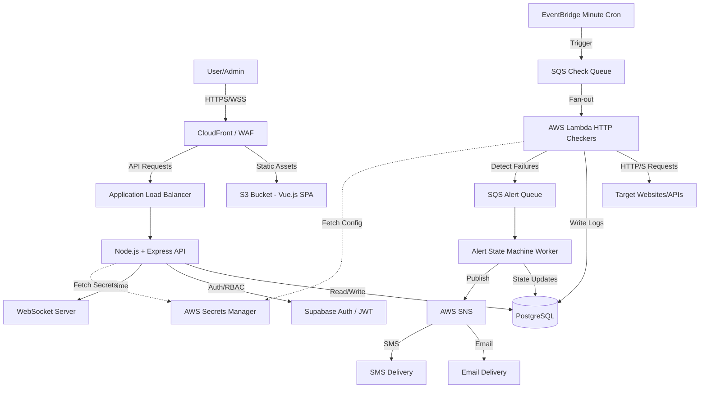

# Production-Ready Website Monitoring Platform Specification

This document provides the end-to-end specifications and implementation details for a security-hardened website monitoring platform, based on the provided authoritative checklist.

## 1. Architecture Diagram (Components + Data Flow)



## 2. Complete DB Schema (DDL + Indexes)

```sql
-- Enable UUID extension
CREATE EXTENSION IF NOT EXISTS "uuid-ossp";

-- Websites Table
CREATE TABLE websites (
    id UUID PRIMARY KEY DEFAULT uuid_generate_v4(),
    owner_id UUID NOT NULL,
    name VARCHAR(255) NOT NULL,
    url VARCHAR(2048) NOT NULL,
    method VARCHAR(10) DEFAULT 'GET',
    headers JSONB DEFAULT '{}',
    is_owned BOOLEAN DEFAULT false,
    tags TEXT[] DEFAULT '{}',
    check_interval_s INTEGER NOT NULL DEFAULT 300,
    timeout_ms INTEGER NOT NULL DEFAULT 10000,
    response_time_threshold_ms INTEGER DEFAULT 2000,
    failure_threshold INTEGER DEFAULT 2,
    recovery_threshold_minutes INTEGER DEFAULT 10,
    maintenance_windows JSONB DEFAULT '[]',
    alert_email TEXT[] DEFAULT '{}',
    alert_sms TEXT[] DEFAULT '{}',
    is_active BOOLEAN DEFAULT true,
    last_status_code INTEGER,
    last_check_at TIMESTAMP WITH TIME ZONE,
    next_check_at TIMESTAMP WITH TIME ZONE DEFAULT NOW(),
    created_at TIMESTAMP WITH TIME ZONE DEFAULT NOW(),
    updated_at TIMESTAMP WITH TIME ZONE DEFAULT NOW()
);

CREATE INDEX idx_websites_owner_active ON websites(owner_id, is_active);
CREATE INDEX idx_websites_next_check ON websites(next_check_at) WHERE is_active = true;
CREATE INDEX idx_websites_url ON websites(url);
CREATE INDEX idx_websites_tags ON websites USING GIN (tags);

-- Monitoring Logs Table (Partitioned by range for 12+ month retention)
CREATE TABLE monitoring_logs (
    id UUID DEFAULT uuid_generate_v4(),
    website_id UUID NOT NULL REFERENCES websites(id) ON DELETE CASCADE,
    owner_id UUID NOT NULL,
    timestamp TIMESTAMP WITH TIME ZONE NOT NULL DEFAULT NOW(),
    status_code INTEGER,
    response_time_ms INTEGER,
    request_duration_ms INTEGER,
    check_status VARCHAR(20) CHECK (check_status IN ('success', 'failed', 'timeout')),
    error_type VARCHAR(100),
    error_message TEXT,
    region VARCHAR(50),
    checker_node_id VARCHAR(100),
    PRIMARY KEY (id, timestamp)
) PARTITION BY RANGE (timestamp);

-- Example partition creation (would be automated)
CREATE TABLE monitoring_logs_y2024m01 PARTITION OF monitoring_logs FOR VALUES FROM ('2024-01-01') TO ('2024-02-01');

CREATE INDEX idx_logs_website_time ON monitoring_logs(website_id, timestamp DESC);
CREATE INDEX idx_logs_owner_time ON monitoring_logs(owner_id, timestamp DESC);

-- Alerts Table
CREATE TABLE alerts (
    id UUID PRIMARY KEY DEFAULT uuid_generate_v4(),
    website_id UUID NOT NULL REFERENCES websites(id) ON DELETE CASCADE,
    alert_type VARCHAR(20) CHECK (alert_type IN ('downtime', 'recovery', 'slow', 'security')),
    alert_state VARCHAR(20) CHECK (alert_state IN ('open', 'resolved', 'acknowledged')),
    failure_count INTEGER DEFAULT 1,
    triggered_timestamp TIMESTAMP WITH TIME ZONE NOT NULL DEFAULT NOW(),
    resolved_timestamp TIMESTAMP WITH TIME ZONE,
    escalation_level INTEGER DEFAULT 0,
    delivery_methods TEXT[] DEFAULT '{}',
    metadata JSONB DEFAULT '{}'
);

CREATE INDEX idx_alerts_website_time ON alerts(website_id, triggered_timestamp DESC);
CREATE INDEX idx_alerts_state ON alerts(alert_state);

-- Audit Logs Table (Append-only)
CREATE TABLE audit_logs (
    id UUID PRIMARY KEY DEFAULT uuid_generate_v4(),
    actor_user_id UUID NOT NULL,
    action_type VARCHAR(100) NOT NULL,
    target_type VARCHAR(50) NOT NULL,
    target_id UUID,
    metadata JSONB DEFAULT '{}',
    timestamp TIMESTAMP WITH TIME ZONE NOT NULL DEFAULT NOW(),
    ip VARCHAR(45),
    user_agent TEXT
);

CREATE INDEX idx_audit_logs_actor ON audit_logs(actor_user_id, timestamp DESC);
```

## 3. Full API Spec (Swagger/OpenAPI Snippet)

```yaml
openapi: 3.0.0
info:
  title: Website Monitoring API
  version: "1.0"
components:
  securitySchemes:
    bearerAuth:
      type: http
      scheme: bearer
      bearerFormat: JWT
security:
  - bearerAuth: []
paths:
  /websites:
    get:
      summary: List monitored websites
      responses:
        '200':
          description: A list of websites
    post:
      summary: Add a new website target
      requestBody:
        required: true
        content:
          application/json:
            schema:
              $ref: '#/components/schemas/WebsiteInput'
      responses:
        '201':
          description: Created
  /websites/{id}/test-check:
    post:
      summary: Trigger an immediate test HTTP check
      responses:
        '200':
          description: Check result (status_code, response_time_ms)
  /metrics/uptime:
    get:
      summary: Get uptime percentage
      parameters:
        - name: website_id
          in: query
          required: true
          schema:
            type: string
        - name: period
          in: query
          schema:
            type: string
            enum: [1h, 24h, 7d, 30d]
      responses:
        '200':
          description: Uptime metrics
  /security/headers/{id}:
    get:
      summary: Get security header analysis for a site
      responses:
        '200':
          description: Security headers report (CSP, HSTS, etc.)
```

## 4. Core Code Modules

### 4.1 Advanced HTTP Checker (Node.js/Lambda)

```javascript
const axios = require('axios');
const https = require('https');
const crypto = require('crypto');

const client = axios.create({
  timeout: 10000,
  validateStatus: () => true, // Resolve all HTTP statuses
  maxRedirects: 5,
  httpsAgent: new https.Agent({ 
    rejectUnauthorized: true, // Strict TLS verification
    keepAlive: false
  })
});

async function checkSite(site) {
  const start = Date.now();
  let result = {
    website_id: site.id,
    timestamp: new Date().toISOString(),
    status_code: null,
    response_time_ms: 0,
    check_status: 'failed',
    error_type: null,
    error_message: null
  };

  try {
    const response = await client({
      url: site.url,
      method: site.method,
      headers: { ...site.headers, 'User-Agent': 'MonitorBot/1.0' },
      timeout: site.timeout_ms
    });

    result.status_code = response.status;
    result.response_time_ms = Date.now() - start;
    
    // Security checks (e.g., SSL cert expiry) can be extracted from response.request.res.socket
    
    if (response.status >= 200 && response.status < 300) {
      result.check_status = 'success';
      
      // Optional content verification
      if (site.tags.includes('api') && typeof response.data !== 'object') {
        result.check_status = 'failed';
        result.error_type = 'CONTENT_MISMATCH';
        result.error_message = 'Expected JSON response';
      }
    } else {
      result.error_type = 'HTTP_ERROR';
      result.error_message = `HTTP Status ${response.status}`;
    }
  } catch (error) {
    result.response_time_ms = Date.now() - start;
    if (error.code === 'ECONNABORTED') {
      result.check_status = 'timeout';
      result.error_type = 'TIMEOUT';
      result.error_message = `Request timed out after ${site.timeout_ms}ms`;
    } else {
      result.error_type = 'NETWORK_ERROR';
      result.error_message = error.message;
    }
  }
  
  return result;
}
```

### 4.2 Alerting State Machine (Worker)

```javascript
async function processCheckResult(result, siteConfig) {
  // 1. Fetch current open alert for this site
  const openAlert = await db.query(`SELECT * FROM alerts WHERE website_id = $1 AND alert_state = 'open'`, [siteConfig.id]);
  
  // 2. Evaluate Downtime
  if (result.check_status !== 'success') {
    await incrementFailureCount(siteConfig.id);
    const consecutiveFailures = await getFailureCount(siteConfig.id);
    
    if (consecutiveFailures >= siteConfig.failure_threshold && !openAlert) {
      // Create Downtime Alert
      const alert = await createAlert(siteConfig.id, 'downtime');
      await escalateAlert(alert, siteConfig);
    }
  } 
  // 3. Evaluate Recovery
  else if (result.check_status === 'success' && openAlert && openAlert.alert_type === 'downtime') {
    const downtimeDuration = (Date.now() - new Date(openAlert.triggered_timestamp).getTime()) / 60000;
    
    if (downtimeDuration >= siteConfig.recovery_threshold_minutes) {
      await resolveAlert(openAlert.id);
      const recoveryAlert = await createAlert(siteConfig.id, 'recovery');
      await sendNotification(recoveryAlert, siteConfig.alert_email, 'RECOVERY');
    }
    await resetFailureCount(siteConfig.id);
  }
}
```

## 5. Vue.js Component Structure

```text
src/
├── components/
│   ├── layout/
│   │   ├── Sidebar.vue        # Navigation with RBAC visibility
│   │   ├── Topbar.vue         # Profile, Notifications, Org switcher
│   ├── dashboard/
│   │   ├── StatusGrid.vue     # Main grid of site cards (green/yellow/red)
│   │   ├── SiteCard.vue       # Individual site status
│   │   ├── QuickStats.vue     # Aggregate metrics
│   ├── analytics/
│   │   ├── UptimeChart.vue    # Toast UI time-series chart
│   │   ├── OutageHeatmap.vue  # Hour/Day heatmap component
│   │   ├── ResponseTrend.vue  # P95 / Avg latency line chart
│   ├── sites/
│   │   ├── SiteFormModal.vue  # Add/Edit configuration
│   │   ├── SiteDetailTabs.vue # Overview, Logs, Alerts, Security tabs
│   ├── alerts/
│   │   ├── AlertConfig.vue    # Threshold sliders, channel toggles
│   │   ├── AlertHistory.vue   # Paginated table of past alerts
│   ├── security/
│   │   ├── SslStatus.vue      # Certificate health display
│   │   ├── HeadersReport.vue  # Security headers analysis table
├── views/
│   ├── HomeView.vue           # Dashboard
│   ├── SitesView.vue          # Site management
│   ├── AnalyticsView.vue      # Global analytics
│   ├── AuditLogsView.vue      # Security/Audit logs
├── store/                     # Pinia or Vuex (auth, sites, real-time status)
├── router/                    # Vue Router with navigation guards (auth/roles)
```

## 6. Deployment Scripts (Terraform snippet)

```hcl
# AWS Lambda for HTTP Checker
resource "aws_lambda_function" "http_checker" {
  filename         = "checker.zip"
  function_name    = "monitor-http-checker"
  role             = aws_iam_role.lambda_exec.arn
  handler          = "index.handler"
  runtime          = "nodejs18.x"
  timeout          = 30
  
  environment {
    variables = {
      DB_HOST = aws_db_instance.postgres.endpoint
    }
  }
}

# EventBridge Rule (Every Minute)
resource "aws_cloudwatch_event_rule" "every_minute" {
  name                = "every-minute-rule"
  schedule_expression = "rate(1 minute)"
}

resource "aws_cloudwatch_event_target" "trigger_scheduler" {
  rule      = aws_cloudwatch_event_rule.every_minute.name
  target_id = "TriggerScheduler"
  arn       = aws_lambda_function.scheduler.arn
}

# SNS Topic for Alerts
resource "aws_sns_topic" "alerts" {
  name = "monitoring-alerts"
  kms_master_key_id = "alias/aws/sns" # Encryption at rest
}
```

## 7. Security Testing Plan

1. **Static Application Security Testing (SAST)**:
   - Run `npm audit` and Snyk weekly.
   - Use ESLint security plugins (`eslint-plugin-security`).
2. **Dynamic Application Security Testing (DAST)**:
   - Run OWASP ZAP scans against staging environments monthly.
   - Verify JWT handling, CSRF tokens, and input validation bounds.
3. **Infrastructure Security**:
   - AWS Inspector to scan EC2/Lambda environments.
   - IAM least-privilege review (Lambda roles should only write to specific SQS/DB tables).
   - Verify public S3 buckets are disabled.
4. **Data Protection**:
   - Verify DB connections enforce `sslmode=require`.
   - Ensure `alert_email` and sensitive config fields are masked in standard API responses where appropriate.

## 8. Monitoring System Self-Health Checks

The monitoring platform must monitor itself to avoid silent failures:
1. **Queue Depth Alarms**: Alert via PagerDuty/Slack if SQS `ApproximateNumberOfMessagesVisible` > 1000 (indicates Lambda concurrency limits or DB write bottlenecks).
2. **Stale Check Detection**: A watchdog cron job running every 5 minutes querying `SELECT count(*) FROM websites WHERE next_check_at < NOW() - INTERVAL '5 minutes' AND is_active = true`. If count > 0, the scheduler is failing.
3. **Canary Sites**: The system must permanently monitor highly reliable endpoints (e.g., `https://1.1.1.1` or `https://google.com`). If the canary fails, the system pauses external alerts (suppressing false positives due to the monitoring system's own outbound network failure).
4. **Database Connections**: Track active Postgres connections; alert if approaching 80% of max capacity.
