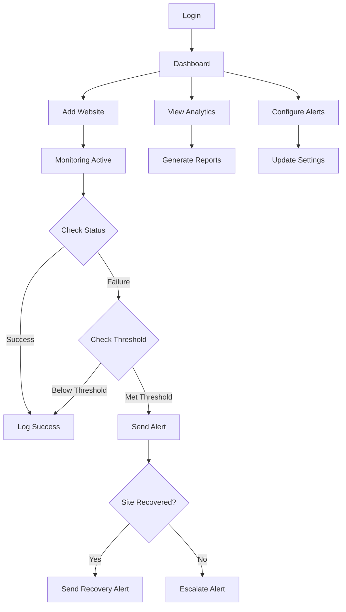

## 1. Product Overview

A comprehensive website monitoring system that tracks uptime, response times, and outages for multiple personal websites with professional-grade analytics and intelligent alerting. The system provides real-time health monitoring, historical trend analysis, and multi-channel alerts to ensure website reliability.

This product solves the problem of website downtime awareness by providing automated monitoring with detailed analytics, helping website owners maintain optimal performance and quickly respond to issues before they impact users.

## 2. Core Features

### 2.1 User Roles

| Role | Registration Method | Core Permissions |
|------|---------------------|------------------|
| Website Owner | Email registration | Add/remove websites, configure monitoring settings, receive alerts, view analytics |
| Admin | System assignment | Manage all websites, system configuration, user management |

### 2.2 Feature Module

Our website monitoring system consists of the following main pages:

1. **Dashboard**: Real-time status grid, current health indicators, quick stats overview
2. **Website Management**: Add/edit/delete websites, configure monitoring intervals and thresholds
3. **Analytics**: Historical charts, uptime percentages, response time trends, outage analysis
4. **Alert Configuration**: Set alert thresholds, notification preferences, escalation rules
5. **Event Logs**: Detailed monitoring history, filtering by site/date/type, drill-down capabilities
6. **Reports**: Weekly/monthly summaries, performance rankings, export capabilities

### 2.3 Page Details

| Page Name | Module Name | Feature description |
|-----------|-------------|---------------------|
| Dashboard | Status Grid | Display all monitored websites with color-coded health indicators (green/red/yellow) |
| Dashboard | Quick Stats | Show total websites, current outages, average response time, uptime percentage |
| Dashboard | Real-time Updates | Auto-refresh status indicators when websites change state |
| Website Management | Add Website | Configure URL, name, check interval (5min for owned, 30min for external), timeout settings |
| Website Management | Edit Configuration | Modify alert thresholds, response time limits, notification preferences |
| Website Management | Bulk Operations | Enable/disable monitoring for multiple sites simultaneously |
| Analytics | Time-series Charts | Visualize status codes over time using interactive charts with zoom/pan |
| Analytics | Uptime Calculations | Calculate uptime percentages for custom date ranges with trend indicators |
| Analytics | Response Time Trends | Display average/min/max response times with slow-load detection |
| Analytics | Outage Analysis | Group outages by duration, identify peak failure times by hour/day |
| Alert Configuration | Threshold Settings | Set consecutive failure counts, response time limits, downtime duration requirements |
| Alert Configuration | Notification Channels | Configure email and SMS alerts with AWS SNS integration |
| Alert Configuration | Escalation Rules | Set repeat intervals for unresolved alerts, escalation timeframes |
| Event Logs | Detailed History | Show all monitoring events with timestamps, status codes, response times |
| Event Logs | Advanced Filtering | Filter by website, date range, event type, status code |
| Event Logs | Export Functionality | Download logs in CSV/JSON formats for external analysis |
| Reports | Weekly Summaries | Automated email reports with key metrics and trends |
| Reports | Performance Rankings | Rank sites by reliability, response speed, outage frequency |
| Reports | Custom Date Ranges | Generate reports for any specified time period |

## 3. Core Process

**Website Owner Flow:**
1. User registers and logs into the monitoring dashboard
2. Adds websites to monitor with URL and configuration settings
3. System begins automated HTTP checks at specified intervals
4. Dashboard displays real-time status of all monitored sites
5. When issues occur, system sends alerts via configured channels
6. User receives recovery notifications when sites return to normal
7. User accesses analytics to review historical performance and trends

**Alert System Flow:**
1. Monitoring system detects failed HTTP response or slow response time
2. System checks failure threshold (e.g., 2 consecutive failures)
3. If threshold met, triggers alert via primary channel (email)
4. Tracks alert status and repeats at configured intervals if unresolved
5. Escalates to SMS after specified duration (e.g., 30 minutes)
6. Detects when site returns to 200 OK status
7. Sends recovery alert if downtime exceeded minimum threshold

## 4. User Interface Design

### 4.1 Design Style
- **Primary Colors**: Deep blue (#2563eb) for headers, green (#10b981) for success, red (#ef4444) for failures
- **Secondary Colors**: Light gray (#f3f4f6) for backgrounds, dark gray (#374151) for text
- **Button Style**: Rounded corners (8px radius), subtle shadows, hover effects
- **Font**: Inter for headers, system-ui for body text
- **Layout**: Card-based design with consistent spacing, top navigation bar
- **Icons**: Heroicons for consistency, color-coded status indicators

### 4.2 Page Design Overview

| Page Name | Module Name | UI Elements |
|-----------|-------------|-------------|
| Dashboard | Status Grid | Responsive grid layout with 3-4 columns on desktop, 1-2 on mobile. Each card shows site name, current status dot, last check time, response time |
| Dashboard | Quick Stats | Horizontal stat cards with large numbers, subtle background gradients, trend indicators with arrows |
| Analytics | Time-series Charts | Full-width charts with date range picker, legend toggle, zoom controls. Toast UI Chart integration |
| Analytics | Uptime Metrics | Circular progress indicators for uptime percentages, color-coded based on thresholds |
| Website Management | Configuration Forms | Multi-step forms with validation, test connection button, preview of monitoring settings |
| Alert Configuration | Threshold Sliders | Interactive sliders for numeric thresholds, toggle switches for boolean settings |
| Event Logs | Data Table | Sortable columns, pagination, row expansion for details, export buttons |

### 4.3 Responsiveness
- Desktop-first design with mobile adaptation
- Breakpoints: 640px (mobile), 768px (tablet), 1024px (desktop)
- Touch-optimized interactions for mobile devices
- Collapsible navigation menu on mobile
- Responsive charts that adapt to screen size

### 4.4 3D Scene Guidance
Not applicable for this monitoring dashboard application.