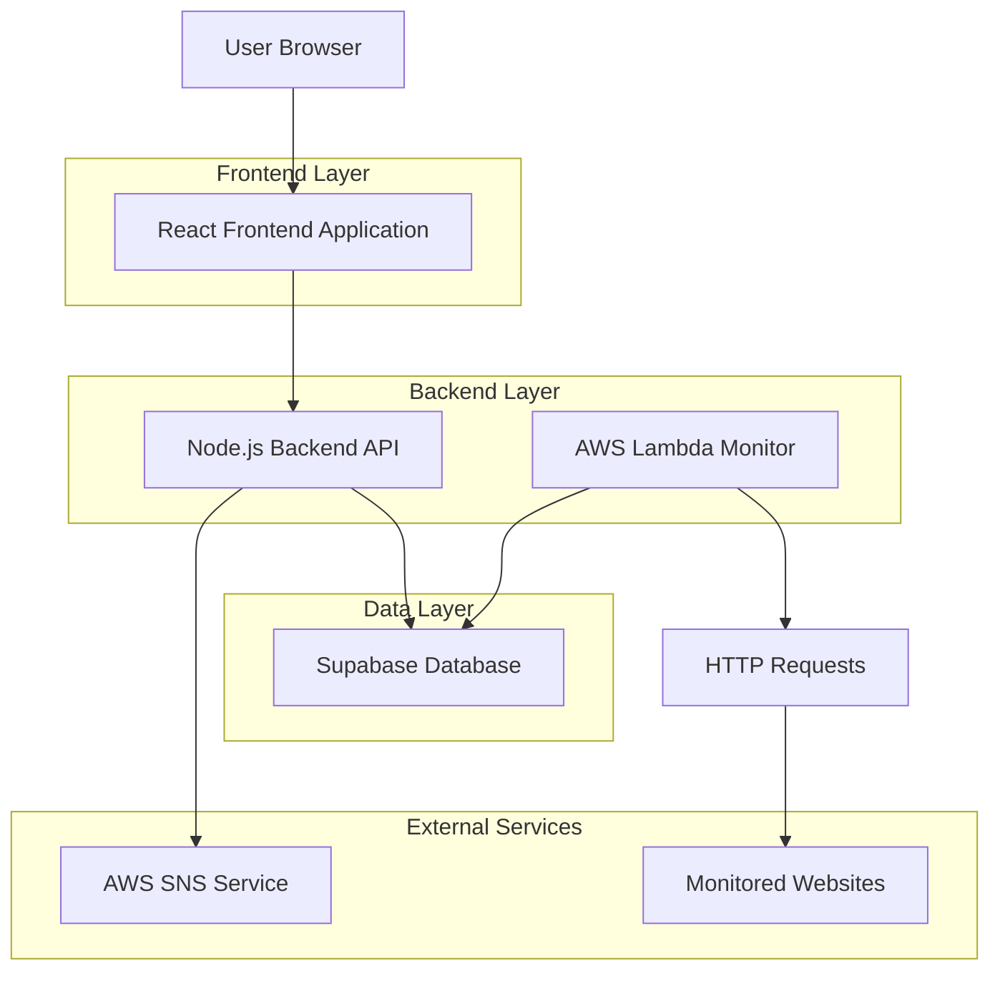
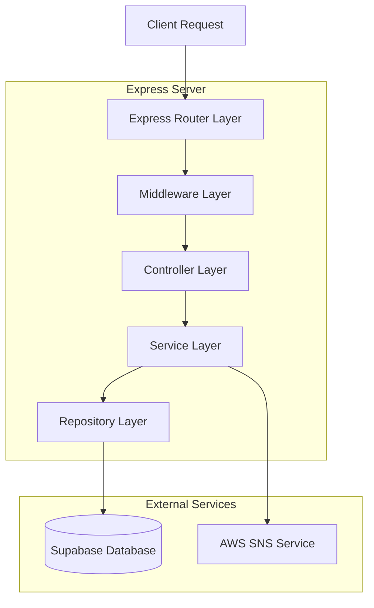
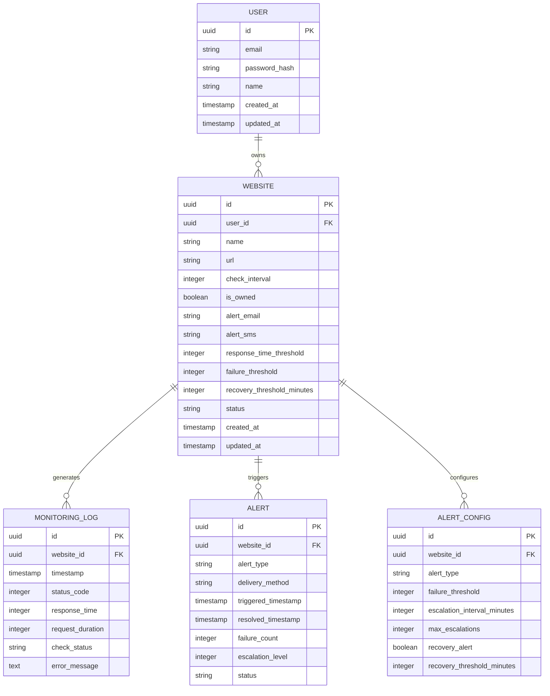

## 1. Architecture Design



## 2. Technology Description

- **Frontend**: React@18 + tailwindcss@3 + vite + Toast UI Chart
- **Initialization Tool**: vite-init
- **Backend**: Node.js@18 + Express@4
- **Database**: Supabase (PostgreSQL)
- **Monitoring**: AWS Lambda + CloudWatch Events
- **Notifications**: AWS SNS

## 3. Route Definitions

| Route | Purpose |
|-------|---------|
| / | Dashboard with real-time status grid |
| /websites | Website management (add/edit/delete) |
| /analytics | Historical charts and uptime analysis |
| /alerts | Alert configuration and history |
| /reports | Generate and view performance reports |
| /settings | System configuration and user preferences |
| /api/auth/* | Authentication endpoints |
| /api/websites/* | Website CRUD operations |
| /api/monitoring/* | Monitoring data and analytics |
| /api/alerts/* | Alert management and configuration |

## 4. API Definitions

### 4.1 Website Management API

**Create Website**
```
POST /api/websites
```

Request:
| Param Name | Param Type | isRequired | Description |
|------------|------------|------------|-------------|
| name | string | true | Website display name |
| url | string | true | Website URL to monitor |
| check_interval | integer | true | Check frequency in minutes (5 or 30) |
| is_owned | boolean | true | Whether site is owned by user |
| alert_email | string | false | Email for notifications |
| alert_sms | string | false | Phone number for SMS alerts |
| response_time_threshold | integer | false | Response time alert threshold (ms) |
| failure_threshold | integer | false | Consecutive failures before alert |
| recovery_threshold_minutes | integer | false | Minimum downtime for recovery alert |

Response:
```json
{
  "id": "uuid",
  "status": "active",
  "created_at": "2024-01-01T00:00:00Z"
}
```

**Get Website Status**
```
GET /api/websites/{id}/status
```

Response:
```json
{
  "website_id": "uuid",
  "current_status": "up",
  "last_check": "2024-01-01T12:00:00Z",
  "last_response_time": 245,
  "last_status_code": 200,
  "uptime_24h": 99.9,
  "uptime_7d": 99.5,
  "uptime_30d": 99.8
}
```

### 4.2 Monitoring Data API

**Get Monitoring Logs**
```
GET /api/monitoring/logs
```

Query Parameters:
| Param Name | Param Type | Description |
|------------|------------|-------------|
| website_id | string | Filter by website |
| start_date | string | Start date (ISO 8601) |
| end_date | string | End date (ISO 8601) |
| status | string | Filter by status (up/down) |
| limit | integer | Maximum results (default: 100) |

Response:
```json
{
  "logs": [
    {
      "id": "uuid",
      "website_id": "uuid",
      "timestamp": "2024-01-01T12:00:00Z",
      "status_code": 200,
      "response_time": 245,
      "check_status": "success"
    }
  ],
  "total": 150,
  "page": 1
}
```

**Get Analytics Data**
```
GET /api/monitoring/analytics
```

Query Parameters:
| Param Name | Param Type | Description |
|------------|------------|-------------|
| website_id | string | Filter by website (optional) |
| period | string | Time period (24h, 7d, 30d) |
| metric | string | Metric type (uptime, response_time, outages) |

Response:
```json
{
  "period": "7d",
  "website_id": "uuid",
  "uptime_percentage": 99.5,
  "average_response_time": 234,
  "total_outages": 3,
  "total_downtime_minutes": 45,
  "peak_outage_hours": [2, 14, 22],
  "response_time_trend": [
    {"timestamp": "2024-01-01T00:00:00Z", "avg_response_time": 245},
    {"timestamp": "2024-01-01T01:00:00Z", "avg_response_time": 238}
  ]
}
```

### 4.3 Alert Management API

**Create Alert Configuration**
```
POST /api/alerts/config
```

Request:
```json
{
  "website_id": "uuid",
  "alert_type": "downtime",
  "failure_threshold": 2,
  "escalation_interval_minutes": 60,
  "max_escalations": 5,
  "recovery_alert": true,
  "recovery_threshold_minutes": 10
}
```

**Get Alert History**
```
GET /api/alerts/history
```

Query Parameters:
| Param Name | Param Type | Description |
|------------|------------|-------------|
| website_id | string | Filter by website |
| alert_type | string | Filter by type (downtime/recovery/slow_response) |
| status | string | Filter by status (triggered/resolved) |
| start_date | string | Start date filter |

## 5. Server Architecture Diagram



## 6. Data Model

### 6.1 Data Model Definition



### 6.2 Data Definition Language

**Users Table**
```sql
-- create table
CREATE TABLE users (
    id UUID PRIMARY KEY DEFAULT gen_random_uuid(),
    email VARCHAR(255) UNIQUE NOT NULL,
    password_hash VARCHAR(255) NOT NULL,
    name VARCHAR(100) NOT NULL,
    created_at TIMESTAMP WITH TIME ZONE DEFAULT NOW(),
    updated_at TIMESTAMP WITH TIME ZONE DEFAULT NOW()
);

-- create index
CREATE INDEX idx_users_email ON users(email);
```

**Websites Table**
```sql
-- create table
CREATE TABLE websites (
    id UUID PRIMARY KEY DEFAULT gen_random_uuid(),
    user_id UUID NOT NULL REFERENCES users(id),
    name VARCHAR(255) NOT NULL,
    url VARCHAR(500) NOT NULL,
    check_interval INTEGER NOT NULL CHECK (check_interval IN (5, 30)),
    is_owned BOOLEAN DEFAULT true,
    alert_email VARCHAR(255),
    alert_sms VARCHAR(20),
    response_time_threshold INTEGER DEFAULT 5000,
    failure_threshold INTEGER DEFAULT 2,
    recovery_threshold_minutes INTEGER DEFAULT 10,
    status VARCHAR(20) DEFAULT 'active' CHECK (status IN ('active', 'paused', 'deleted')),
    created_at TIMESTAMP WITH TIME ZONE DEFAULT NOW(),
    updated_at TIMESTAMP WITH TIME ZONE DEFAULT NOW()
);

-- create indexes
CREATE INDEX idx_websites_user_id ON websites(user_id);
CREATE INDEX idx_websites_status ON websites(status);
CREATE INDEX idx_websites_check_interval ON websites(check_interval);
```

**Monitoring Logs Table**
```sql
-- create table
CREATE TABLE monitoring_logs (
    id UUID PRIMARY KEY DEFAULT gen_random_uuid(),
    website_id UUID NOT NULL REFERENCES websites(id),
    timestamp TIMESTAMP WITH TIME ZONE NOT NULL,
    status_code INTEGER,
    response_time INTEGER,
    request_duration INTEGER,
    check_status VARCHAR(20) CHECK (check_status IN ('success', 'failed', 'timeout')),
    error_message TEXT
);

-- create indexes
CREATE INDEX idx_monitoring_logs_website_id ON monitoring_logs(website_id);
CREATE INDEX idx_monitoring_logs_timestamp ON monitoring_logs(timestamp DESC);
CREATE INDEX idx_monitoring_logs_website_timestamp ON monitoring_logs(website_id, timestamp DESC);
CREATE INDEX idx_monitoring_logs_check_status ON monitoring_logs(check_status);
```

**Alerts Table**
```sql
-- create table
CREATE TABLE alerts (
    id UUID PRIMARY KEY DEFAULT gen_random_uuid(),
    website_id UUID NOT NULL REFERENCES websites(id),
    alert_type VARCHAR(20) CHECK (alert_type IN ('downtime', 'recovery', 'slow_response')),
    delivery_method VARCHAR(10) CHECK (delivery_method IN ('email', 'sms')),
    triggered_timestamp TIMESTAMP WITH TIME ZONE NOT NULL,
    resolved_timestamp TIMESTAMP WITH TIME ZONE,
    failure_count INTEGER DEFAULT 1,
    escalation_level INTEGER DEFAULT 0,
    status VARCHAR(20) DEFAULT 'open' CHECK (status IN ('open', 'resolved', 'escalated'))
);

-- create indexes
CREATE INDEX idx_alerts_website_id ON alerts(website_id);
CREATE INDEX idx_alerts_triggered_timestamp ON alerts(triggered_timestamp DESC);
CREATE INDEX idx_alerts_status ON alerts(status);
```

**Alert Configurations Table**
```sql
-- create table
CREATE TABLE alert_configs (
    id UUID PRIMARY KEY DEFAULT gen_random_uuid(),
    website_id UUID NOT NULL REFERENCES websites(id),
    alert_type VARCHAR(20) CHECK (alert_type IN ('downtime', 'recovery', 'slow_response')),
    failure_threshold INTEGER DEFAULT 2,
    escalation_interval_minutes INTEGER DEFAULT 60,
    max_escalations INTEGER DEFAULT 5,
    recovery_alert BOOLEAN DEFAULT true,
    recovery_threshold_minutes INTEGER DEFAULT 10,
    created_at TIMESTAMP WITH TIME ZONE DEFAULT NOW()
);

-- create index
CREATE INDEX idx_alert_configs_website_id ON alert_configs(website_id);
```

**Supabase Row Level Security (RLS) Policies**
```sql
-- Enable RLS
ALTER TABLE websites ENABLE ROW LEVEL SECURITY;
ALTER TABLE monitoring_logs ENABLE ROW LEVEL SECURITY;
ALTER TABLE alerts ENABLE ROW LEVEL SECURITY;
ALTER TABLE alert_configs ENABLE ROW LEVEL SECURITY;

-- Create policies
CREATE POLICY "Users can view own websites" ON websites
    FOR SELECT USING (auth.uid() = user_id);

CREATE POLICY "Users can manage own websites" ON websites
    FOR ALL USING (auth.uid() = user_id);

CREATE POLICY "Users can view monitoring logs for own websites" ON monitoring_logs
    FOR SELECT USING (
        EXISTS (
            SELECT 1 FROM websites 
            WHERE websites.id = monitoring_logs.website_id 
            AND websites.user_id = auth.uid()
        )
    );

-- Grant permissions
GRANT SELECT ON websites TO anon;
GRANT ALL PRIVILEGES ON websites TO authenticated;
GRANT SELECT ON monitoring_logs TO authenticated;
GRANT ALL PRIVILEGES ON alerts TO authenticated;
GRANT ALL PRIVILEGES ON alert_configs TO authenticated;
```